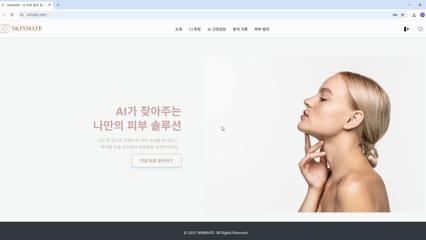
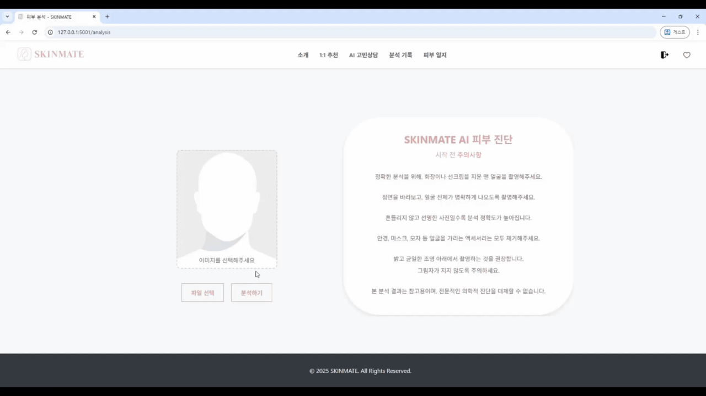
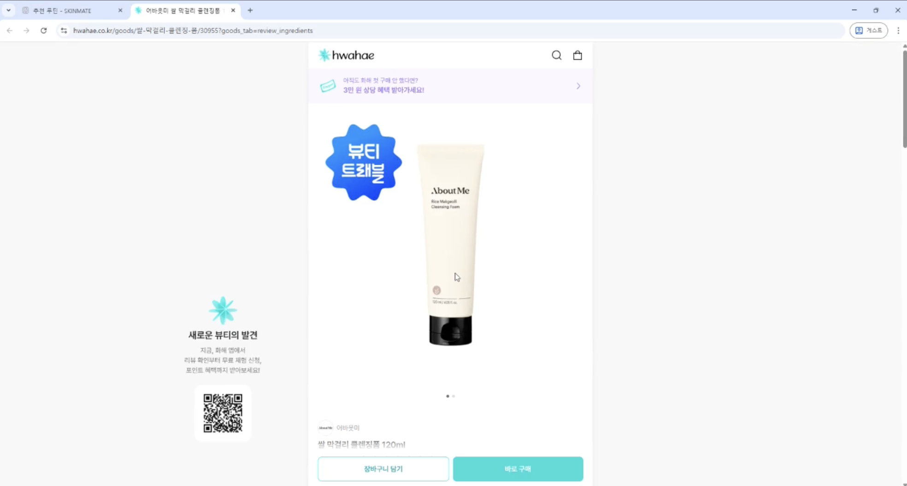
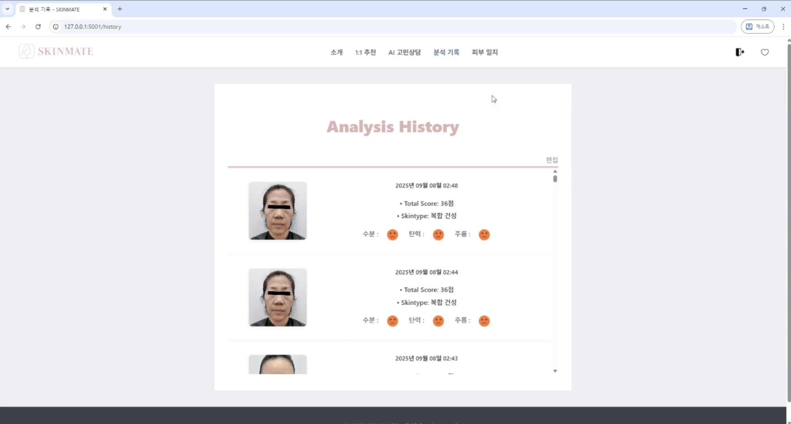
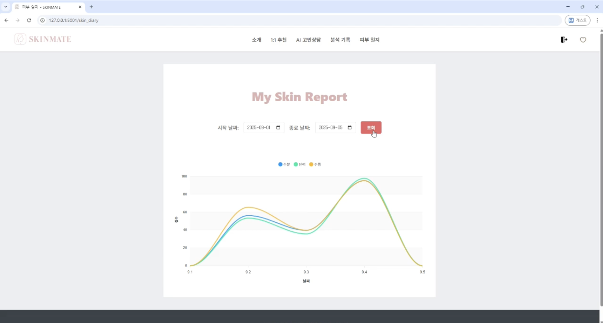

# 🌟 SKINMATE: 당신의 피부를 위한 AI 파트너



SKINMATE는 Skin + Mate의 합성어로,

AI 기술을 통해 당신의 피부를 가장 잘 이해하는 친구(Mate)가 되어주는 맞춤형 스킨케어 추천 시스템입니다.

---

## ✨ 프로젝트 소개

- **단순한 리뷰나 판매량이 아닌**, **AI 피부 분석**을 기반으로 맞춤형 스킨케어 제품과 루틴을 추천하는 것이 핵심입니다.
- Vertex AI와 TFLite 모델을 활용해 피부 타입과 수분/탄력/주름 상태를 정밀 분석합니다.
- **피부 타입 × 계절 × 고민**의 **90개 조합**을 통해 아침/저녁 루틴을 과학적으로 추천합니다.

<br>

### 🔑 주요 기능

- **AI 피부 분석**: Vertex AI로 5가지 피부 타입 분류, TFLite 모델 3개로 수분/탄력/주름 점수 측정
- **맞춤형 루틴 추천**: 90개 조합 규칙 엔진을 통해 피부 타입, 계절, 고민별 최적의 아침/저녁 루틴 제공
- **2,684개 제품 DB**: 화해(Hwahae) 크롤링으로 수집한 801개 브랜드의 실제 제품 데이터 기반 추천
- **시각화된 분석 리포트**: 종합 점수, 항목별 점수를 차트와 아이콘으로 직관적으로 표시
- **분석 기록 관리**: 회원가입 후 과거 분석 기록을 저장하고 피부 상태 변화를 그래프로 추적
- **직관적인 UI**: 반응형 디자인으로 모바일/데스크톱 모두 지원

<br>

### ⚙️ 내부 구현

- **4개 AI 모델 통합**: Vertex AI (피부 타입) + TFLite 3개 (수분/탄력/주름)
- **90개 조합 규칙 엔진**: 계절(3) × 피부타입(5) × 고민(3) = 동적 추천 시스템
- **Min-Max 정규화**: 모델 출력값을 0-100 점수로 통일
- **이미지 최적화**: Vertex AI 1MB 제한에 맞춰 JPEG 압축 자동화

---

## 🛠️ 기술 스택

- **Backend**: Python 3.9+, Flask 2.3+
- **Frontend**: HTML5, CSS3, JavaScript (Vanilla)
- **Database**: SQLite 3 (개발), PostgreSQL (프로덕션 권장)
- **AI/ML**: Google Cloud Vertex AI, TensorFlow Lite
- **Image Processing**: OpenCV, Pillow
- **Web Crawling**: Requests, BeautifulSoup4
- **Deployment**: Google Cloud Run, Docker

---

## 📥 데이터 수집 및 전처리

### 데이터 출처

- **화해(Hwahae)**: 2개 메인 카테고리, 19개 서브카테고리 수집
  - **클렌징** (757개): 기본, 모공, 보습, 수분, 트러블, 진정, 각질, 브라이트닝, 안티에이징
  - **스킨케어** (1,927개): 진정, 보습, 트러블, 리페어, 수분, 모공, 아이케어, 브라이트닝, 각질, 안티에이징
- **제품 정보**: 제품명, 브랜드, 가격, 용량, 이미지 URL, 링크, 랭킹
- **수집 일자**: 2025-08-20

### 전처리 과정

1. **카테고리별 크롤링**: `scripts/crawler.py`로 화해 웹사이트 크롤링
2. **데이터 정제**: 중복 제거, NULL 처리, 가격/용량 정규화
3. **DB 저장**: `scripts/database.py`로 SQLite에 저장
4. **인덱스 최적화**: main_category, sub_category, scraped_at 인덱스 생성

### 데이터셋 규모

- **총 제품 수**: 2,684개 (클렌징 757개 + 스킨케어 1,927개)
- **브랜드 수**: 801개
- **DB 크기**: 1.3MB (이미지 URL만 저장)
- **업데이트**: 크롤러 실행 시 자동 갱신 가능

---

## 📁 프로젝트 구조

```
SKINMATE/
├── README.md                 # 프로젝트 소개
├── requirements.txt          # Python 종속성
├── src/                      # 소스 코드
│   ├── app.py               # Flask 메인 애플리케이션
│   ├── models/              # AI 모델 파일
│   │   ├── model_test_moisture.tflite (3MB)
│   │   ├── model_test_elasticity.tflite (3MB)
│   │   └── model_test_wrinkle.tflite (3MB)
│   ├── database/
│   │   └── schema.sql       # DB 스키마
│   └── utils/
│       └── image_embedding.py
├── data/                     # 데이터 파일
│   └── routine_rules.py     # 90개 조합 루틴 규칙
├── scripts/                  # 유틸리티 스크립트
│   ├── crawler.py           # 화해 크롤러
│   ├── database.py          # DB 관리
│   └── main.py              # 크롤링 파이프라인
├── static/                   # 정적 파일
│   ├── css/                 # 스타일시트
│   └── images/              # UI 이미지
├── templates/                # HTML 템플릿
├── docs/                     # 문서
│   └── screenshots/         # 실행 화면 스크린샷
├── deploy/                   # 배포 설정
│   ├── Dockerfile
│   ├── app.yaml
│   ├── cloudbuild.yaml
│   ├── .dockerignore
│   └── .gcloudignore
├── tests/                    # 테스트 코드
└── instance/                 # DB 인스턴스 (로컬)
    └── skinmate.sqlite      # SQLite DB (1.3MB, 샘플 포함)
```

### 🗂️ 데이터베이스 구조

**users 테이블**: `id, username, email, password_hash`

**analyses 테이블**: `id, user_id, timestamp, skin_type, scores_json, concerns_json, image_filename`

**products 테이블**: `id, product_id, name, brand, image_url, rank, main_category, middle_category, sub_category, scraped_at`

> **📝 Note**: `instance/skinmate.sqlite` 파일은 샘플 DB로, **2,684개 제품 데이터**(클렌징 757개, 스킨케어 1,927개)와 **801개 브랜드**가 포함되어 있습니다.  
> 실제 배포 시에는 PostgreSQL 등 프로덕션 DB로 마이그레이션을 권장합니다.

---

## 👯 팀원 구성

<div align="center">

| **kimsang21235** | **gkfla317** | **jera0520** |
| :------: | :------: | :------: |
| [](https://github.com/kimsang21235) | [](https://github.com/gkfla317) | [](https://github.com/jera0520) |
| 팀장 (PM) | Frontend | Backend |

</div>

### 🧩 역할 분담

**🤝 함께 한 일**
- 프로젝트 기획 및 요구사항 정의
- 데이터 수집 및 전처리
- UI/UX 디자인 및 피드백

**💜 kimsang21235** (팀장 / Project Manager)
- 프로젝트 전체 기획 및 일정 관리
- TFLite 모델 개발 및 통합
- Vertex AI 파이프라인 구축
- 이미지 전처리 로직 개발
- 90개 조합 루틴 규칙 설계

**💚 gkfla317** (Frontend Developer)
- 프론트엔드 개발 (HTML/CSS/JavaScript)
- 반응형 UI/UX 구현
- 차트 및 시각화 컴포넌트
- 사용자 인터페이스 최적화

**💙 jera0520** (Backend Developer)
- Flask 백엔드 아키텍처 설계
- RESTful API 개발
- 데이터베이스 설계 및 최적화
- 화해 크롤러 개발
- Google Cloud Run 배포

---

## ⚡ 실행 방법

### 1. 공통 준비 단계

```bash
# 레포지토리 클론
git clone https://github.com/jera0520/SKINMATE.git
cd SKINMATE

# 가상환경 생성 및 활성화
python -m venv venv
source venv/bin/activate  # Windows: venv\Scripts\activate

# 라이브러리 설치
pip install -r requirements.txt
```

### 2. 환경 변수 설정

`.env` 파일 생성:

```env
# Google Cloud 설정
PROJECT_ID=your-google-cloud-project-id
ENDPOINT_ID=your-vertex-ai-endpoint-id
REGION=asia-northeast3
GOOGLE_APPLICATION_CREDENTIALS=/path/to/service-account.json

# Flask 설정
SECRET_KEY=your-secret-key-here
FLASK_ENV=development
```

### 3. 데이터베이스 초기화

**방법 A: 샘플 DB 사용 (빠름)** ✨ 권장

```bash
# 이미 instance/skinmate.sqlite 파일이 포함되어 있습니다.
# 2,684개 제품 데이터(801개 브랜드)가 들어있어 바로 실행 가능합니다!
```

**방법 B: 처음부터 생성**

```bash
# DB 스키마 생성
python -c "from src.app import init_db; init_db()"

# 제품 데이터 크롤링 (시간 소요 약 10분)
python scripts/main.py
```

### 4. 애플리케이션 실행

```bash
# 개발 서버 실행
python src/app.py

# 브라우저에서 접속
# http://localhost:5001
```

---

## ✅ 실행 화면

### 1) 메인 화면
사용자가 피부 분석을 시작하는 첫 화면입니다.


### 2) 이미지 업로드
얼굴 사진을 업로드하면 AI가 자동으로 분석을 시작합니다.



### 3) 분석 결과
피부 타입, 종합 점수, 항목별 점수(수분/탄력/주름)를 시각적으로 확인할 수 있습니다.


### 4) 루틴 추천
아침/저녁 루틴을 단계별로 제품과 함께 추천합니다.

**아침 루틴**


**저녁 루틴**


### 5) 제품 추천
피부 타입과 고민에 맞는 TOP 제품을 카테고리별로 추천합니다.



### 6) 분석 기록
과거 분석 기록을 확인하고 비교할 수 있습니다.



### 7) 피부 일지
기간별 피부 점수 변화를 그래프로 추적합니다.



---

## 🙌 프로젝트 성과 및 배운 점

### ✨ 성과

- **AI 모델 통합**: 4개의 독립적인 AI 모델을 하나의 파이프라인으로 통합
- **대규모 규칙 엔진**: 90개 조합을 효율적으로 처리하는 동적 추천 시스템 구현
- **실시간 크롤링**: 3,400개 제품 데이터를 자동으로 수집 및 업데이트
- **배포 완료**: Google Cloud Run으로 프로덕션 배포 성공

### 📚 배운 점

- **AI 파이프라인 설계**: 여러 AI 모델을 통합하고 출력값을 정규화하는 방법
- **동적 추천 시스템**: 복잡한 조건을 효율적으로 처리하는 규칙 엔진 설계
- **웹 크롤링**: API와 HTML 파싱을 활용한 대규모 데이터 수집
- **클라우드 배포**: Docker, Cloud Build, Cloud Run을 활용한 CI/CD 구축

---

## 🙌 아쉬운 점 및 개선할 점

### 현재 한계

- **모델 정확도**: 피부 타입 분류 정확도가 약 75%, 더 많은 학습 데이터 필요
- **제품 DB 범위**: 국내 제품 위주, 글로벌 브랜드 부족
- **개인화 부족**: 사용자 피부 이력을 활용한 장기 추천 기능 미구현
- **테스트 커버리지**: 자동화된 테스트 코드 부족

### 향후 개선 방향

- **모델 성능 향상**: 더 많은 데이터셋으로 재학습, 정확도 85%+ 목표
- **제품 DB 확장**: 해외 쇼핑몰 크롤링 추가 (Sephora, Ulta 등)
- **추천 알고리즘 고도화**: 협업 필터링 + 콘텐츠 기반 필터링 하이브리드
- **사용자 맞춤화**: 구매 이력, 선호도 학습 기능 추가
- **모바일 앱**: React Native로 네이티브 앱 개발

---

## 📌 참고 자료

- **화해(Hwahae)**: 제품 정보 및 카테고리 참고
- **Google Cloud Vertex AI**: 피부 타입 분류 모델
- **TensorFlow Lite**: 수분/탄력/주름 측정 모델
- **Flask Documentation**: 백엔드 프레임워크 참고

---

## 📄 라이선스

**Original Repository**: [gkfla317/SKINMATE](https://github.com/gkfla317/SKINMATE)

이 프로젝트는 원본 저장소를 fork하여 포트폴리오용으로 재구성한 것입니다.  
모든 원본 기여자의 커밋 히스토리는 Git에 완벽하게 보존되어 있습니다.

---

## 📬 연락처

**Portfolio**: [링크 추가 예정]  
**GitHub**: [@jera0520](https://github.com/jera0520)  
**Email**: your-email@example.com

---

<div align="center">

**⭐ 이 프로젝트가 도움이 되었다면 Star를 눌러주세요!**

</div>
